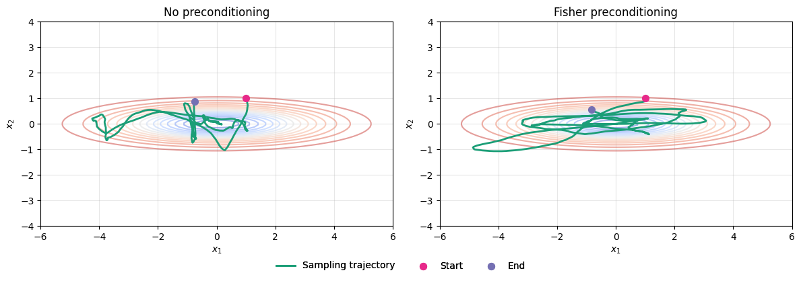

# Warmstart Preconditioning for SG-MCMC

This repository implements experiments on enhancing stochastic gradient Markov Chain Monte Carlo (SG-MCMC) samplers through mass matrix preconditioning. We focus on 2D problems for intuitive visualization.

<div style="text-align: center;">
    
    <div style="font-size: 0.95em; color: #555;">
        <em>Effect of preconditioning on the SG-MCMC sampling trajectory.</em>
    </div>
</div>

## Features

- **Generate experiment data**: Generate a synthetic ground truth for controlled experiments.
- **Configure preconditioners**: Various mass matrix preconditioning strategies for SGHMC samplers.
- **Evaluation framework**: Unified experiment execution and evaluation.
- **Visualization**: Generate plots for trajectory analysis and posterior comparison.

## Setup

1.) Clone or fork this repository

2.) Install pipx:
```
pip install --user pipx
```

3.) Install Poetry:
```
pipx install poetry
```

*3a.) Optionally (if you want the env-folder to be created in your project)*:
```
poetry config virtualenvs.in-project true
```

4.) Install this project:
```
poetry install
```

*4a.) If the specified Python version (3.12 for this project) is not found:*

If the required Python version is not installed on your device, install Python from the official [python.org](https://www.python.org/downloads) website.

Then run
```
poetry env use <path-to-your-python-version>
```
and install the project:
```
poetry install
```
